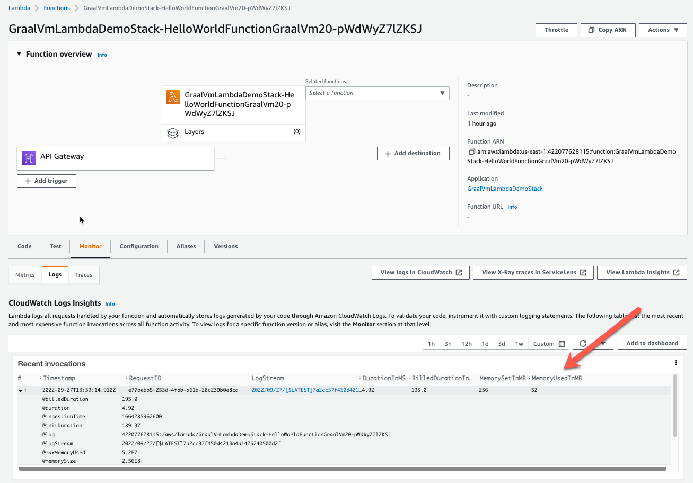
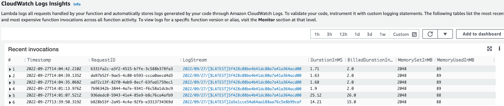
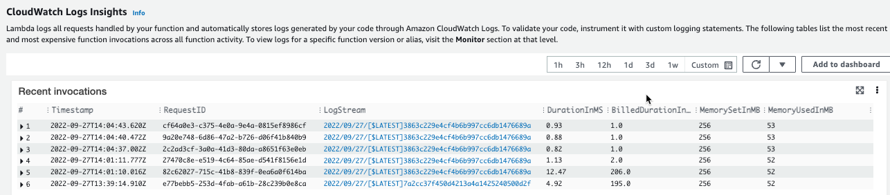

# graalvm-lambda-demo

Hello world app deployed as an AWS Lambda as a fat Java JAR and also as a [GraalVM native image](https://www.graalvm.org/22.2/docs/getting-started/#native-image) using the AWS CDK. Useful for 
comparing building/deploying native vs pure Java on Lambdas.

This demo was derived from:
* https://github.com/marksailes/graalvm-on-lambda (described in https://www.graalvmonlambda.com/, but slightly outdated)
* https://github.com/aws-samples/serverless-graalvm-demo

Companion presentation: https://kitomann.com/#/sessions/7/scale-up-with-graalvm-and-aws-lambdas.
See the presentation for background information (i.e. why use GraalVM, Lambda overview, etc).

## Pre-requisites:

To build this project, you must have the following installed:

* Maven 3.6.3
* [GraalVM 22.0.0.2](https://www.graalvm.org/22.2/docs/getting-started/#install-graalvm) with [native image tool](https://www.graalvm.org/22.2/docs/getting-started/#native-image)
* [AWS CDK CLI](https://docs.aws.amazon.com/cdk/v2/guide/cli.html)
  * If you don't have your credentials configured, an easy way to do it is to [install the AWS CLI](https://docs.aws.amazon.com/cli/latest/userguide/getting-started-install.html) and [configure them through the `aws` command](https://docs.aws.amazon.com/cli/latest/userguide/cli-configure-quickstart.html).
* [Docker Desktop](https://www.docker.com/products/docker-desktop/)

## Building and deploying

Building and deployment is a two-step process:

1. Build the Java JAR

```bash
cd function
mvn clean package
```

> NOTE: You don't need to build the native image here, because this needs to be done on the target OS (Amazon Linux). It will be handled by the deployment process.

2. Deploy to AWS Lambda

> TIP: Make sure Docker Desktop is running before deploying.

> NOTE: Currently this project is set to build using an ARM Docker image and deploy to 
> [Lambda ARM architecture](https://docs.aws.amazon.com/lambda/latest/dg/foundation-arch.html#foundation-arch-adv)
> (which is cheaper). To change to x86, edit [InfrastructureStack.java](infra/src/main/java/virtua/demo/graalvm/lambda/InfrastructureStack.java).

The follow command does the following:
   1. Deploy the Java JAR using the AWS Java 11 Runtime
   2. Build a native image in an Amazon Linux Docker container and deploy a ZIP using an Amazon Linux custom runtime

```bash
cd infra
cdk deploy
```

> NOTE: If the deployment fails, use `cdk --debug deploy` to get some more info about the root cause.

After deployment is complete, each deployment outputs a URL you can use for testing:

```bash
Outputs:
GraalVmLambdaDemoStack.HelloWorldGraalApiUrl = https://bchs2cynrg.execute-api.us-east-1.amazonaws.com/hello-world-graal
GraalVmLambdaDemoStack.HelloWorldJvmApiUrl = https://bchs2cynrg.execute-api.us-east-1.amazonaws.com/hello-world-jvm
GraalVmLambdaDemoStack.HelloWorldJvmSnapStartApiUrl = https://bchs2cynrg.execute-api.us-east-1.amazonaws.com/hello-world-jvm-snapstert
```

And you can use `curl` (or your browser) to test:

```bash
$ curl https://bchs2cynrg.execute-api.us-east-1.amazonaws.com/hello-world-jvm
Hello world!
$ curl https://bchs2cynrg.execute-api.us-east-1.amazonaws.com/hello-world-graal
Hello world!
$ curl https://bchs2cynrg.execute-api.us-east-1.amazonaws.com/hello-world-jvm-snapstert
Hello world!
```

If you log into the AWS Console, you'll be able to find the following artifacts:

* CloudFormation Stack: GraalVmLambdaDemoStack
* Lambda: GraalVmLambdaDemoStack-HelloWorldFunctionGraalVm<id>
* Lambda: GraalVmLambdaDemoStack-HelloWorldFunctionJvm<id>
* Lambda: GraalVmLambdaDemoStack-LogRetentiona<id>
* API Gateway Route: GraalVmLambdaDemoApi
  * Route: /hello-world-graal
  * Route: /hello-world-jvm

To see how these are configured, look at [InfrastructureStack.java](infra/src/main/java/virtua/demo/graalvm/lambda/InfrastructureStack.java).

> NOTE: I've also added another function called `GraalVmLambdaDemoStack-HelloWorldFunctionJvmSnapstart`. Currently this is exactly the same as `HelloWorldFunctionJvm`, because SnapStart doesn't appear to be supported yet in the Java CDK. You must manually enable it as described here: https://docs.aws.amazon.com/lambda/latest/dg/snapstart-activate.html#snapshot-console.

## Performance

You can find performance info in the AWS Console; the easiest way is to view the Lambda function, Monitor -> Logs and 
expand the request:



In general, you can expect the native image to have a faster cold start time, a faster response time, and lower memory utilization.

Java Runtime Logs:



Native Image Custom Runtime Logs:


